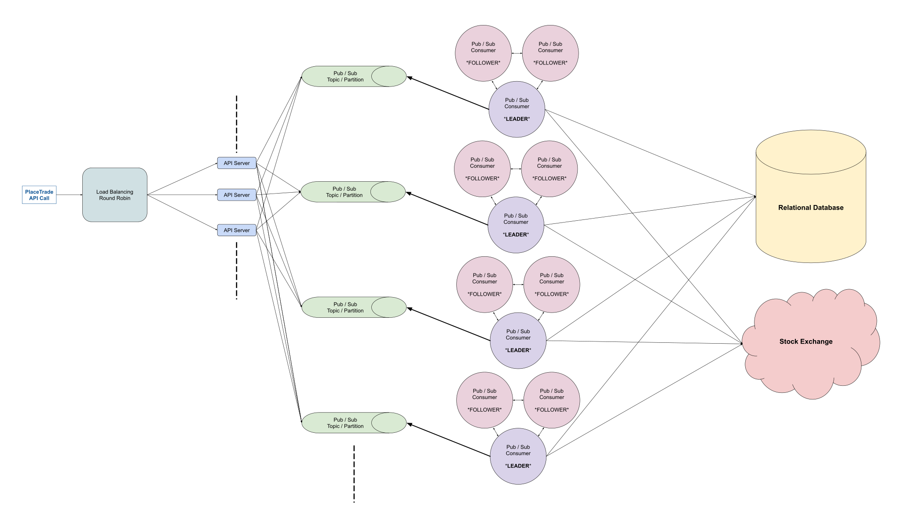

# 设计：股票经纪平台

## 澄清要问的问题

- **问：我们所说的股票经纪平台究竟是什么意思？这像 Robinhood 或 Etrade 吗？**

  答：是的，完全正确。

- **问：平台应该支持什么？我们只是支持客户买卖股票的能力，还是支持更多？例如，我们是否允许在我们的平台上交易其他类型的证券，如期权和期货？我们是否支持特殊类型的订单，例如限价单和止损单？**

  答：我们只支持这种设计中股票的市价单。市价单是指，给定买卖股票的订单，无论股价如何，我们都应尽快执行该订单。我们也没有设计任何“保证金”系统，因此可用余额是可用于购买的真实来源。

- **问：我们是否设计了股票经纪的任何辅助方面，例如存取款、下载税务文件等？**

  答：不 —— 我们只是在设计平台的核心交易方面的内容。

- **问：我们只是设计交易系统吗？我们是否要支持其他与贸易相关的操作，例如获取贸易状态？换句话说，支持这个平台的 API 应该有多全面？**

  答：本质上，您只是围绕来自用户的 PlaceTrade API 调用设计一个系统，但您应该定义该 API 调用（输入、响应等）。

- **问：客户的余额存储在哪里？平台是直接从客户的银行账户中提取资金，还是我们期望客户已经以某种方式将资金存入平台？换句话说，我们是否需要与银行互动？**

  答：不，您不会与银行互动。您可以假设客户已经将资金存入平台，您可以进一步假设您有一个 SQL 表，其中包含每个想要进行交易的客户的余额。

- **问：我们为多少客户构建这个系统？我们的客户群是全球性的吗？**

  答：数百万客户，每天数百万笔交易。假设我们的客户仅位于 1 个地区 —— 例如北美。

- **问：我们的系统需要什么样的可用性？**

  答：尽可能高，使用这种服务，即使系统宕机几分钟，人们也会损失很多钱。

- **问：我们是否也在为这个平台设计 UI？我们可以假设我们必须支持哪些类型的客户？**

  答：您不必设计 UI，但您应该设计 UI 将对您的后端进行的 PlaceTrade API 调用。客户端可以是移动应用程序或网络应用程序。

- **问：所以我们想为实际经纪业务设计 API，它本身代表客户与一些中央证券交易所进行交互。这个交易所有 API 吗？如果是，我们是否知道它是什么样子的，对此我们是否有任何保证？**

  答：是的，交易所有一个 API，您平台的 API（PlaceTrade 调用）必须与交易所的 API 交互。就这一点而言，您可以假设调用交易所进行实际交易将接受回调（除了有关交易的信息），该回调将在交易所完成交易时执行（意思是，当交易被 FILLED 或 REJECTED 时，此回调将被执行）。你也可以假设交易所的系统是高度可用的 —— 你的回调总是至少被执行一次。

## 1 收集系统要求

与任何系统设计面试问题一样，我们要做的第一件事就是收集系统需求；我们需要弄清楚我们正在构建什么系统。

我们正在建立一个像 Robinhood 这样的股票经纪平台，作为最终客户和一些中央证券交易所之间的中介。这个想法是中央证券交易所是实际执行股票交易的平台，而股票经纪平台只是客户想要进行交易时与其对接的平台 —— 股票经纪平台“更简单”，更“可读” ，可以这么说。

我们只关心支持市场交易 —— 以当前股票价格执行的交易 —— 我们可以假设我们的系统将客户余额（即，客户之前可能存入的资金）存储在 SQL 表中。

我们需要设计一个 PlaceTrade API 调用，并且我们知道中央交易所的等效 API 方法将接受一个回调，该回调保证在对该 API 方法的调用完成后执行。

我们正在设计这个系统，以支持每天来自单个地区（例如北美）数百万客户的数百万笔交易。我们希望系统具有高可用性。

## 2 制定计划

重要的是要将必要的信息组织起来，并就我们将如何处理我们的设计制定一个清晰的计划。我们的系统有哪些主要的、可区分的组件？

我们将从前到后进行设计：

- 客户将进行的 PlaceTrade API 调用
- 处理客户端 API 调用的 API 服务器
- 负责为每个客户执行订单的系统

我们需要确保以下情况：

- 每一笔交易都必须保证是成功或者失败的，永远不会处于未完成的中间状态
- 单个客户的交易必须按照他们下达的顺序执行
- 余额永远不会变成负数

## 3 API 调用

我们必须实现的核心 API 调用是 PlaceTrade。

我们将其签名定义为：

```
PlaceTrade(
  customerId: string,
  stockTicker: string,
  type: string (BUY/SELL),
  quantity: integer,
) => (
  tradeId: string,
  stockTicker: string,
  type: string (BUY/SELL),
  quantity: integer,
  createdAt: timestamp,
  status: string (PLACED),
  reason: string,
)
```

客户 ID 可以从只有用户知道并传递到 API 调用中的身份验证令牌生成。

状态可以是以下之一：

- PLACED
- IN PROGRESS
- FILLED
- REJECTED

话虽如此，PLACED 实际上是这里的实际状态，因为一旦交易所执行我们的回调，其他状态将被异步设置。换句话说，当 PlaceTrade API 调用返回时，交易状态将始终为 PLACED，但我们可以想象 GetTrade API 调用可能返回 PLACED 以外的状态。

拒绝交易的潜在原因可能是：

- 资金不足
- 随机金额误差
- 滞后的市场时间

## 4 API 服务器

我们需要多个 API 服务器来处理所有传入的请求。由于我们在进行交易时不需要任何缓存，因此我们不需要任何缓存服务，我们可以使用一些轮询的负载均衡来在我们的 API 服务器之间分配传入的请求。

一旦 API 服务器收到 PlaceTrade 调用，它们会将交易存储在 SQL 表中。该表需要与 balances 表位于同一个 SQL 数据库中，因为我们需要使用 ACID 事务以原子方式更改这两个表。

trades （交易）的 SQL 表如下所示：

- id: string, 一个随机的、自动生成的字符串
- customer_id: string, 进行交易的客户的 id
- stockTicker: string, 被交易股票的股票代码
- type: string, 买入或卖出
- quantity: integer (没有小数), 要交易的股数
- status: string, 交易状态；从 PLACED 开始
- created_at: timestamp, 交易创建的时间
- reason: string, 易于理解的交易状态原因

balances（余额）的 SQL 表将如下所示：

- id: string, 一个随机的、自动生成的字符串
- customer_id: string, 余额相关的客户 id
- amount: float, 客户拥有的金额
- last_modified: timestamp, 余额最后一次修改的时间

## 5 交易执行队列

每秒有数百个订单下达，trades 表将非常庞大。我们需要找到一种可靠的方法来实际执行我们的交易并更新我们的表数据，同时确保以下几点：

我们要确保对于单个客户，我们在任何时候都只处理一个买入交易，因为我们需要防止客户的余额达到负值。

鉴于市场订单的性质，在我们得到交易所的回应之前，我们永远不知道交易将在交易所执行的确切金额价值，因此我们必须与交易所通讯才能知道交易是否可以通过。

我们可以使用发布/订阅模式来设计系统的这一部分。这个想法是使用像 Apache Kafka 或 Google Cloud Pub/Sub 这样的消息队列，并拥有一组客户 ID 映射到的主题。这为我们提供了至少一次交付语义，以确保我们不会错过新交易。当客户进行交易时，API 服务器将一行写入数据库并创建一条消息，该消息被路由到该客户的主题（使用哈希方式），通知主题的订阅者有新交易。

这为我们提供了保证，对于单个客户，我们只有一个线程随时尝试执行他们的交易。

主题的订阅者可以是 3 个 Workers 的群体（本质上是服务器集群），它们使用领导者选举让 1 个主 Workers 为集群工作（这是为了保证我们系统的高可用性） —— 领导者在消息被推送时抓取消息到主题并通过调用交易所为消息中包含的客户执行交易。如上所述，单个客户的交易只由同一个集群处理，这使我们的逻辑和 SQL 查询更清晰。

至于我们需要多少主题和 Workers 集群，我们可以做一些粗略的估计。如果我们计划每天执行数百万笔交易，考虑到一天三分之一的开放交易时间和不统一的交易模式，这可以归结为每秒大约 10-100 笔交易。如果我们假设核心执行逻辑持续大约一秒钟，那么我们应该有大约 10-100 个主题和 Workers 集群来并行处理交易。

```
每天约 100,000 秒 (3600 * 24)
每天约 1,000,000 笔交易
交易集中在一天的 1/3 时间中
--> (1,000,000 / 100,000) * 3 = 每秒约 30 笔交易
```

## 6 交易执行逻辑

订阅者（我们的 Workers）以流式传输/等待消息。想象一下以下消息将到达主题队列：

```
{"customerId": "c1"}
```

以下是工作逻辑的伪代码：

```
// 查询最旧的未处于终止状态的交易。
trade = SELECT * FROM trades WHERE
    customer_id = 'c1' AND
    (status = 'PLACED' OR status = 'IN PROGRESS')
    ORDER BY created_at ASC LIMIT 1;

// 如果交易已推送，我们知道它已经有效
// 准备好执行。我们将其设置为进行中。
if trade.status == "PLACED" {
    UPDATE trades SET status = 'IN PROGRESS' WHERE id = trade.id;
}

// 如果这笔交易以某种方式已存在于交易所中，等待回调来完成交易
if exchange.TradeExists(trade.id) {
    return;
}

// 我们取得客户的余额。
balance = SELECT amount FROM balances WHERE
    customer_id = 'c1';

// 这是在交易实际完成后，交易所将执行的回调函数。
callback = ...

exchange.Execute(
    trade.stockTicker,
    trade.type,
    trade.quantity,
    max_price = balance,
    callback,
)
```

## 7 交易回调

下面是交易回调的一些伪代码：

```
function exchange_callback(exchange_trade) {
    // 交易完成的情况
    if exchange_trade.status == 'FILLED' {
        // 启动一个数据库事务
        BEGIN TRANSACTION;
        // 查询交易信息
        trade = SELECT * FROM trades WHERE id = database_trade.id;
        // 如果交易不是处理中
        if trade.status <> 'IN PROGRESS' {
            // 回滚数据库事务
            ROLLBACK;
            // 重新推送到消息队列中
            pubsub.send({customer_id: database_trade.customer_id});
            // 结束处理
            return;
        }
        // 更新余额
        UPDATE balances SET amount -= exchange_trade.amount WHERE customer_id = database_trade.customer_id;
        // 更新交易状态
        UPDATE trades SET status = 'FILLED' WHERE id = database_trade.id;
        // 提交数据库事务
        COMMIT;
    // 交易被拒绝的情况
    } else if exchange_trade.status == 'REJECTED' {
        // 开启数据库事务
        BEGIN TRANSACTION;
        // 更新交易状态和失败原因
        UPDATE trades SET status = 'REJECTED' WHERE id = database_trade.id;
        UPDATE trades SET reason = exchange_trade.reason WHERE id = database_trade.id;
        // 提交数据库事务
        COMMIT;
    }
    // 重新推送到消息队列中
    pubsub.send({customer_id: database_trade.customer_id});
    // 返回
    return http.status(200);
}
```

## 8 系统架构图



Last Modified 2022-03-13
