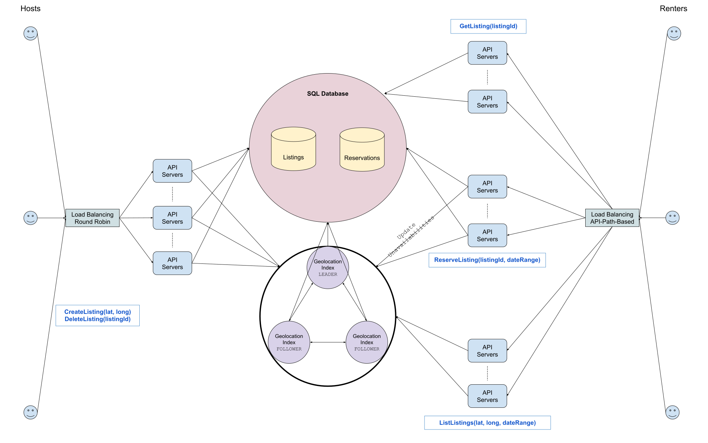

# 设计：Airbnb

## 澄清要问的问题

- **问：像许多其他共享经济产品一样，Airbnb 有两个方面：面向房东的一面和面向租户的一面。我们是在设计这两个方面还是只设计其中之一？**

  答：让我们设计产品的这两个方面。

- **问：因此，我们可能正在为房东设计创建和删除房源的系统，以及为租房者浏览房源、预订和事后管理预订的系统。那是对的吗？**

  答：是的；但实际上让我们只专注于浏览列表并为租房者提供预订。我们可以忽略在面向租户的一方预订后发生的所有事情。

- **问：但是对于预订，当用户浏览特定日期范围内的房源时，如果他们开始预订流程，该房源会被临时保留给他们吗？**

  答：是的。更具体地说，应该允许多个用户在同一日期范围内同时查看同一房源信息，而不会出现问题。但是，一旦用户开始预订房源，如果其他用户尝试预订，则应该反映该房源在相关日期不再可用。

- **问：我明白了。但是，假设两个用户在重叠的日期范围内查看相同的房源，并且其中一个用户按下“立即预订”，此时他们必须输入信用卡等付款所需信息。我们是否应该立即为该房源锁定一段预定时间，比如可能是 15 分钟，如果第一个人确实完成了预订，那么这个“锁定”就变成了永久的？**

  答：是的，这是有道理的。在现实生活中，可能会有细微的差别，但为了这个设计，让我们按这个假设来执行。

- **问：我们是否想设计任何辅助功能，例如能够联系房东、身份验证和支付服务等，或者我们真的只专注于浏览和预订？**

  答：让我们真正专注于浏览和预订。我们可以忽略其余的。

- **问：我明白了。所以，因为听起来我们正在设计整个 Airbnb 服务的一个非常有针对性的部分，所以我想确保我完全了解我们想要支持的每一个功能。我的理解是，用户可以在 Airbnb 的主要网站或应用程序上，他们可以根据某些条件查找房源，例如位置、可用日期范围、定价、房源详细信息等，然后他们可以决定预订位置。至于房东，他们基本上可以像我之前所说的那样创建一个列表并删除它。那是对的吗？**

  答：是的。但实际上，对于这种设计，就列表特征而言，让我们纯粹根据位置和可用日期范围进行过滤；让我们不必担心定价和房源细节等其他标准。

- **问：我们为此设计的规模是多少？具体来说，我们预计大约有多少房源和租房者？**

  答：我们只考虑 Airbnb 在北美的业务。假设有 5000 万用户和 100 万个列表。

- **问：关于可用性和延迟等系统特性，我假设即使租房者在纽约这样人口稠密的地区查找房源，那里可能有很多房源，我们也关心快速、准确地提供这些房源，并且可靠。那是对的吗？**

  答：是的，没错。理想情况下，我们不希望租客浏览房源时，系统存在任何停机时间。

## 1 收集系统要求

与任何系统设计面试问题一样，我们要做的第一件事就是收集系统需求；我们需要弄清楚我们正在构建什么系统。

我们正在设计 Airbnb 背后的核心系统，该系统允许房东创建房源列表，租户可以浏览这些列表并进行预订。

具体来说，我们希望支持：

- 在房东方面，创建和删除房源列表。
- 在租户方面，浏览房源列表、获取单个房源列表和“保留”房源列表。

当租客按下“立即预订”按钮时，应该会发生“预订”房源，并且应该在某个预定时间段（例如 15 分钟）内有效锁定（或预订）房源，在此期间任何其他租客都不应该能够保留列表甚至浏览它（除非他们已经在浏览它）。

我们不需要支持预订后发生的任何事情，但如果租客因为某些问题而未完成预订，则在 15 分钟后释放预订。

关于房源，我们应该专注于根据位置和可用日期范围进行浏览和预订；我们可以忽略任何其他房源特征，如价格、卧室数量等。浏览房源应该尽可能快，并且应该尽快反映新创建的房源。最后，租客不应浏览到已预订和预订中的房源。

我们的系统应该服务于拥有大约 5000 万用户和 100 万个房源列表的北美地区。

## 2 制定计划

我们将通过将其分为两个主要部分来解决这个系统：

- 房东一方
- 租客一方

我们可以将租用方进一步划分如下：

- 浏览（列出）房源列表
- 获取单个房源列表
- 预订房源

## 3 列表存储和四叉树

首先，我们可以期望将所有列表存储在 SQL 表中。这将是我们在 Airbnb 上的房源的主要真实来源，并且每当房东创建或删除房源时，都会写入此 SQL 表。

然后，由于我们关心在 Airbnb 上浏览房源的延迟，并且由于这种浏览需要根据房源的位置查询房源，我们可以将房源存储在区域四叉树中，以便服务于所有浏览功能。

由于我们正在优化速度，因此将这个四叉树存储在一些辅助机器上的内存中是有意义的，我们可以称之为“地理索引”，但我们需要确保我们实际上可以将这个四叉树放入内存中。

在这个四叉树中，我们需要存储所有关于房源的信息，当租客浏览房源时，这些信息需要在 UI 上显示：标题、描述、指向房源图片的链接、唯一的房源 ID 等等

假设单个列表占用大约 10 KB 的空间（作为上限），通过一些简单的数学运算可以证实我们能够在内存中存储我们需要的关于列表的所有内容。

```
~10 KB 每个列表
~1 百万个列表
~10 KB * 1000^2 = 10 GB
```

由于我们将四叉树存储在内存中，因此我们要确保单个机器故障不会影响整个浏览功能。为了确保这一点，我们可以建立一个机器集群，每台机器都在内存中保存一个四叉树的实例，这些机器可以使用领导者选举来保护我们免受机器故障的影响。

我们的四叉树解决方案的工作原理如下：当我们的系统启动时，地理索引机器通过查询我们的 SQL 列表表来创建四叉树。创建或删除列表时，主机首先写入 SQL 表，然后同步更新地理索引 leader 的四叉树。然后，每隔 10 分钟，地理索引 leader 和 followers 都会从 SQL 表中重新创建四叉树，这使他们能够及时刷新列表。

如果 leader 在任何时候故障停机，一个 followers 将取代它，并且新 leader 的四叉树中的数据最多会过时几分钟，直到间隔时间过后强制重新创建四叉树。

## 4 房源列表

当租客浏览列表时，他们会频繁调用 ListListings API 。此 API 调用将根据租客经过的位置在地理索引 leader 的四叉树中搜索相关列表。

找到相关位置应该相当简单且非常快速，特别是因为我们可以估计我们的四叉树将具有大约 10 的深度，因为 4^10 大于 100 万。

话虽如此，我们必须确保我们不会返回在租客指定的日期范围内不可用的房源列表。为了处理这个问题，四叉树中的每个列表都将包含一个不可用日期范围的列表记录，我们可以在这个列表上对每个列表执行简单的二分搜索，以确定相关列表是否可用并且可以让租客浏览。

我们还可以确保我们的四叉树仅返回相关列表的子集以用于分页目的，并且我们可以通过使用偏移量来确定该子集：相关列表的第一页的偏移量为 0，第二页的偏移量为 50（如果我们希望页面的大小为 50），第三页的偏移量将为 100，依此类推。

## 5 获取房源详细信息

这个 API 调用应该非常简单；我们可以期望从租客正在浏览的房源列表中获得房源 ID，并且我们可以简单地查询我们的 SQL 列表以获取给定的 ID 对应的房源信息。

## 6 预订房源

保留房源需要反映在我们的四叉树和我们的持久存储解决方案中。在我们的四叉树中，它们必须从可浏览列表中被排除；在我们的持久存储解决方案中，如果我们的四叉树需要它们，那么主要的数据来源也需要它们。

我们可以有第二个用于保存预订信息的 SQL 表，其中包含房源 ID 以及预订到期的日期范围和时间戳。当租客尝试启动房源的预订过程时，将首先检查预订表以查看在指定日期范围内当前是否有给定房源的预订；如果存在，则向租户返回错误；如果没有，则使用 15 分钟后的过期时间戳开始预订。

在写入预订表之后，我们使用新的预留同步更新地理索引 leader 的四叉树。这个新的预订将只是相关列表的不可用列表中的一个不可用间隔，但我们还将指定此不可用的到期时间，因为它是一个预订状态，还不是定下房源。

我们的四叉树中的房源数据可能如下所示：

```
{
  "unavailabilities": [
    {
      "range": ["2020-09-22T12:00:00-05:00", "2020-09-28T12:00:00-05:00"],
      "expiration": "2020-09-16T12:00:00-04:00"
    }
    {
      "range": ["2020-10-02T12:00:00-05:00", "2020-10-10T12:00:00-05:00"],
      "expiration": null
    },
  ],
  "title": "Listing Title",
  "description": "Listing Description",
  "thumbnailUrl": "Listing Thumbnail URL",
  "id": "Listing ID"
}
```

## 7 负载均衡

在房东一方，我们可以使用简单的循环方法在一组 API 服务器上创建和删除列表的负载均衡其请求。然后 API 服务器将负责写入 SQL 数据库并与地理索引 leader 通信。

在租客一方，我们可以使用基于 API 路径的服务器选择策略在一组 API 服务器上对列出、获取和保留房源的请求进行负载均衡。由于这三个 API 调用的工作负载彼此之间会有很大的不同，因此将这些调用分离到不同的 API 服务器集群是有意义的。

值得注意的是，我们不希望在我们的 API 服务器上进行任何缓存，否则我们会在预订房源和新房源被添加时操作到了陈旧的数据。

## 8 系统架构图



Last Modified 2022-04-10
