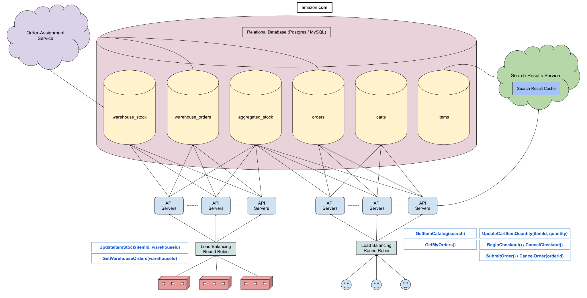

# 设计：亚马逊

## 澄清要问的问题

- **问：亚马逊的电子商务业务有很多功能，但其核心是进入亚马逊主页，查看推荐商品，搜索商品，浏览商品列表和单个商品，将它们添加到购物车，提交订单，甚至可能取消订单。这是我们正在为系统设计的用户流程吗？**

  答：是的，但是为了这个设计，让我们保持简单，假设亚马逊主页只包含一个搜索框。换句话说，您不必担心在主页上列出推荐商品。此外，您可以假设用户一次只能拥有一个购物车；他们无法保存多个购物车。

- **问：我们是否应该设计子系统/推荐引擎来确定用户搜索商品时返回的内容？**

  答：您可以假设有一项服务会在给定一些通过亚马逊搜索框获取的搜索参数的情况下返回相关商品。仅这些服务就可能变得相当复杂，所以让我们专注于这个系统设计问题的其余部分。但是您当然可以将此服务用作您设计的一部分。

- **问：我们是否应该处理商品缺货时发生的情况，或者我们是否假设商品始终有货？**

  答：是的，你应该处理这个。具体来说，您应该防止用户将缺货的商品添加到他们的购物车中，并且订单会“消耗”库存。整个商品库存问题是您应该关注的电子商务系统的一个非常重要的部分。

- **问：我们应该如何处理库存少且多人同时查看的商品？换句话说，我们应该在某种意义上“保留”商品吗？**

  答：这可能是系统中相当复杂的部分，具体取决于您想要的花哨程度。让我们保持简单，并设计如下：如果某个商品在其查看页面上有库存，则任何用户都可以将其添加到他们的购物车中，并且将其添加到他们的购物车中不会“消耗”库存。一旦用户开始结账过程，系统应该提醒他们购物车中的商品自他们添加以来已经缺货，否则，它应该在结账过程期间有效地“保留”该商品，保留时间的上限如 10 分钟。

- **问：我们是否应该设计处理提交订单后发生的事情的系统部分？例如，订单被分派到亚马逊仓库，待派送包裹被分配给指定工作人员等。**

  答：亚马逊订单通常由分散在多个亚马逊仓库中的商品组成。这意味着一些订单最终被拆分为多个子订单，每个子订单都分配到相关仓库。您应该考虑如何将订单或子订单推送到相关仓库，以及仓库内的物品库存如何分配和使用。但是您不必担心在为仓库分配订单或子订单后会发生什么。

- **问：如果一个订单或子订单可以由多个亚马逊仓库处理，我们的系统应该如何确定将该订单路由到哪个仓库？**

  答：与我们之前提到的推荐引擎类似，您可以假设我们可以访问一些智能服务来处理将订单分配到仓库的逻辑。不要担心服务本身 —— 只关心它如何与系统的其他部分交互。但同样，您应该考虑单个仓库中的物品库存将如何发挥其作用。

- **问：我们是否要处理亚马逊的辅助功能，例如亚马逊 Prime、订阅购买、购买旧货与新货等？**

  答：无需处理。

- **问：亚马逊有很多区域性网站/商店。例如，amazon.com、amazon.fr、amazon.in。我们应该设计所有这些，还是我们可以只设计 amazon.com，例如，然后有效地假设该设计适用于所有其他主要区域亚马逊网站？**

  答：为了这个设计，我们只设计 amazon.com，你可以假设 amazon.com 和其他亚马逊网站是完全独立的，但业务/系统相同。因此，您为 amazon.com 设计的任何内容都将适用于 amazon.fr、amazon.in 和其他亚马逊网站。

- **问：就延迟和可靠性而言，我假设我们希望亚马逊在很大程度上具有高可用性，但是如果在您搜索商品、提交订单等时有一点加载时间，是否可以？**

  答：理想情况下，搜索商品应该具有低延迟，但如果开始结帐流程和提交订单需要一些时间，那也没关系。就可靠性而言，为了这个设计，我们不要太担心它。你可以假设你有一个开箱即用的高可用性 SQL 配置，而不用担心可用性细节。我对您将用于支持核心功能的数据库模式设计更感兴趣。

- **问：亚马逊电子商务显然是一个非常庞大的系统。我们与多少客户打交道，我们每天预计会处理多少订单？**

  答：亚马逊有大约 3 亿客户，每小时处理大约 6 万个订单，这意味着大约每秒 20 个订单。如果您是专门为 amazon.com 设计的，我们假设北美占全球所有亚马逊订单的 50%。所以大约每小时 30,000 个订单或每秒 10 个订单。话虽如此，对于这个设计，我更感兴趣的是你的系统将如何支持亚马逊电子商务业务的核心功能，而不是它的规模。

## 1 收集系统要求

与任何系统设计面试问题一样，我们要做的第一件事就是收集系统需求；我们需要弄清楚我们正在构建什么系统。

我们正在设计亚马逊网站的电子商务相关业务，更具体地说，该系统支持用户在亚马逊主页上搜索商品，将商品添加到购物车中，提交订单，以及这些订单被分配到相关的亚马逊仓库进行发货。

我们需要处理缺货的商品，当用户开始结账流程时，我们已经获得了一些简单的“库存预订”系统的指导方针。

我们可以访问两项智能服务：一项处理用户搜索查询，另一项处理仓库订单分配。我们的工作是弄清楚这些服务如何适应我们庞大的设计。

我们将专门设计支持 amazon.com（即亚马逊北美业务）的系统，并且我们假设该系统可以复制到其他地区的亚马逊商店。在本演练的其余部分中，每当我们提到“亚马逊”时，我们将特指亚马逊的北美商店。

虽然系统在搜索商品时应该具有低延迟和高可用性，在北美每秒大约处理 10 个订单，但我们被告知主要关注核心功能。

## 2 制定计划

我们首先要思考如何处理概述中所提到的系统主要的组成部分，然后深入到它的存储组件，最后查看核心功能是如何实现的。

我们可以将核心功能分为两个主要部分：

- 用户端
- 仓库端

我们可以将用户端进一步划分如下：

- 浏览给定搜索词的商品
- 修改购物车
- 开始结帐流程
- 提交和取消订单

## 3 高级系统概述

在一个区域内，用户和仓库请求将循环负载均衡到各自的 API 服务器集群，并且在该区域的 SQL 数据库中读写数据。

我们需要使用 SQL 数据库，因为我们将要处理的所有数据（商品、购物车、订单等）本质上都是结构化的，并且非常适合关系模型。

## 4 SQL 数据表

我们将设计六个 SQL 数据表来支持我们整个系统的存储需求。

### 商品（Items）

该表将存储亚马逊上的所有商品，每一行代表一个商品。

- itemId: uuid, 商品 ID
- name: string, 商品名称
- description: string, 商品描述
- price: integer, 商品价格
- currency: enum, 货币类型（汇率）
- other...

### 购物车（Carts）

该表将存储亚马逊上的所有购物车，每一行代表一个购物车。我们被告知每个用户一次只能拥有一个购物车。

- cartId: uuid, 购物车 ID
- customerId: uuid, 用户 ID
- items: []{itemId, quantity}, 商品集合（商品 ID，数量）

### 订单（Orders）

该表将存储亚马逊上的所有订单，每一行代表一个订单。

- orderId: uuid, 订单 ID
- customerId: uuid, 用户 ID
- orderStatus: enum, 订单状态
- items: []{itemId, quantity}, 商品集合（商品 ID，数量）
- price: integer, 总价格
- paymentInfo: PaymentInfo, 付款信息
- shippingAddress: string, 收货地址
- timestamp: datetime, 时间戳
- other...

### 汇总库存（Aggregated Stock）

该表将存储亚马逊上与用户相关的所有商品库存，每一行代表一个商品。

- itemId: uuid, 商品 ID
- stock: integer, 库存量

### 仓库订单（Warehouse Orders）

该表将存储亚马逊仓库获得的所有订单，每一行代表一个仓库订单。仓库订单要么是整个正常的亚马逊订单，要么是正常的亚马逊订单的子订单。

- warehouseOrderId: uuid, 仓库订单 ID
- parentOrderId: uuid, （父级）订单 ID
- warehouseId: uuid, 仓库 ID
- orderStatus: enum, 订单状态
- items: []{itemId, quantity}, 商品集合（商品 ID，数量）
- shippingAddress: string, 收货地址

### 仓库库存（Warehouse Stock）

此表将存储亚马逊仓库中的所有商品库存，每一行代表一个 {item,warehouse} 配对。physicalStock 字段代表商品在相关仓库中的实际库存，作为实际来源，而 availableStock 字段代表商品在相关仓库中的有效可用库存；当订单分配到仓库时，可用库存会减少。

- itemId: uuid, 商品 ID
- warehouseId: uuid, 仓库 ID
- physicalStock: integer, 库存数量
- availableStock: integer, 当前可用库存数量

## 5 核心用户功能

**GetItemCatalog(searching_text)**

这是用户在搜索项目时调用的接口。请求由 API 服务器路由到智能搜索结果服务，该服务直接与商品表交互，缓存热门商品搜索并返回结果。

API 服务器还从 aggregated_stock 表中获取相关的商品库存。

**UpdateCartItemQuantity(itemId, quantity)**

这是用户在购物车中添加或删除商品时调用的接口。该请求直接写入 carts 表，并且只有当商品在 aggregated_stock 表中有足够的库存时，用户操作才能调用此接口。

**BeginCheckout() & CancelCheckout()**

这些是用户在开始结帐过程并取消结帐过程时调用的接口。BeginCheckout 请求触发对相关商品的 aggregated_stock 表的另一次读取。如果购物车中的某些商品没有足够的库存，UI 会相应地提醒用户。对于确实有足够库存的商品，API 服务器会写入 aggregated_stock 表并相应地减少相关库存，从而在结账期间有效地“保留”商品。CancelCheckout 请求（ 在结帐过程 10 分钟后也会被自动调用）写入 aggregated_stock 表并相应地增加相关库存，从而“取消保留”商品。请注意，所有对 aggregated_stock 的写入都是 ACID 事务，就库存准确性而言，这使我们能够轻松地依赖此 SQL 表。

**SubmitOrder()、CancelOrder() 和 GetMyOrders()**

这些是用户在提交和取消订单时调用的接口。SubmitOrder 和 CancelOrder 请求都写入 orders 表，CancelOrder 也写入 aggregated_stock 表，相应地增加相关库存（SubmitOrder 不需要，因为结帐过程已经有了）。 GetMyOrders 只是从订单表中读取。请注意，只有在尚未发货的情况下才能取消订单，这可以从 orderStatus 字段中得知。

## 6 核心仓库功能

在仓库方面，我们将从订单表中读取数据并通过智能订单分配服务，找出拆分订单的最佳方式，并根据送货地址、商品库存和其他数据将它们分配到仓库，最后将最终的仓库订单写入 warehouse_orders 表。

为了知道哪些仓库有哪些商品以及有多少商品，订单分配服务将依赖于 warehouse_stock 表中相关商品的 availableStock。当服务将订单分配给仓库时，它会减少 warehouse_stock 表中相关仓库的相关项目的 availableStock。如果订单最终被取消，相关仓库会重新增加这些 availableStock 值。

当仓库获得新的商品库存、因任何原因丢失商品库存或实际运送分配订单时，他们将更新 warehouse_stock 表中的相关 physicalStock 值。如果他们获得新的商品库存或丢失商品库存，他们还将写入 aggregated_stock 表（他们在运送分配的订单时不需要这样做，因为 aggregated_stock 表已经在用户的结帐流程中更新了）。

## 7 系统架构图

Last Modified 2022-03-20
