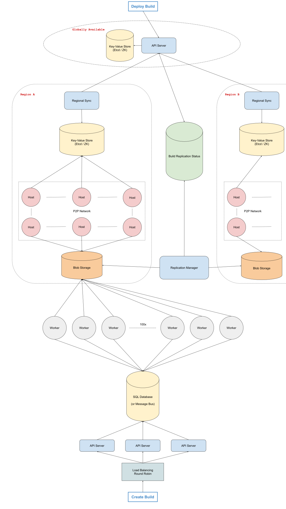

# 设计：代码部署系统

## 澄清要问的问题

- **问：代码部署系统到底是什么意思？我们是在谈论构建、测试和交付代码吗？**

  答：我们希望设计一个系统，它接收代码，将其构建成二进制文件（一个不透明的数据块 —— 编译后的代码），并以一种高效且可扩展的方式在全球范围内部署构建成功后的文件。我们不需要担心测试代码；让我们假设已经完成测试了。

- **问：可以这么说，我们是为软件开发生命周期的哪一部分设计的？这个构建和部署代码的过程是否发生在提交代码以供代码审查、代码被合并到代码仓库或代码交付时？**

  答：一旦代码被合并到中央代码存储库的主干或主分支中，工程师应该能够触发构建并部署该构建（通过我们没有设计的 UI）。那时，代码已经过审查并准备好发布。所以澄清一下，我们不是在设计处理提交审查或合并到主分支中的代码的系统 —— 只是接收合并代码、构建和部署它的系统。

- **问：我们实际上是在尝试通过将代码发送到世界各地的所有应用程序服务器以实现将代码推送到生产环境吗？**

  答：是的，完全正确。

- **问：我们要部署多少台机器？它们需要分布在世界各地吗？**

  答：我们希望这个系统能够大规模扩展到遍布全球 5-10 个地区的数十万台机器。

- **问：这听起来像是一个内部系统。部署这段代码是否有紧迫感？我们能否承受部署过程中的失败或异常？我们希望单个部署执行的时间限制是多少？**

  答：这是一个内部系统，但我们希望有良好的可用性，因为许多中断都是通过前滚或回滚错误代码来解决的，所以这部分基础设施可能是避免某些可怕情况所必需的。就容错而言，任何构建最终都应该达到 SUCCESS 或 FAILURE 状态。成功构建二进制文件后，它应该可以在 30 分钟内发送到全球所有机器。

- **问：听起来我们希望我们的系统可用，但不一定是高可用的，我们希望构建的最终状态清晰，我们希望构建和部署代码的整个过程大约需要 30 分钟。那是对的吗？**

  答：是的，没错。

- **问：我们将多久构建和部署一次代码，构建代码需要多长时间，以及我们将要部署的二进制文件有多大？**

  答：工程师团队每天部署数百个服务或 Web 应用程序数千次；构建代码最多可能需要 15 分钟；最终的二进制文件最大可以达到 10 GB。不过，我们可能要处理数百个不同的应用程序这一事实并不重要。您只是在设计构建管道和部署系统，它们与正在部署的应用程序类型无关。

- **问：在构建代码时，我们如何访问实际代码？是否有某种参考可以用来抓取代码来构建？**

  答：是的；您可以假设您将从已合并到主分支的提交中构建代码。这些提交具有 SHA 标识符（实际上是任意字符串），您可以使用这些标识符来下载需要构建的代码。

## 1 收集系统需求

与任何系统设计面试问题一样，我们要做的第一件事就是收集系统需求；我们需要弄清楚我们正在构建什么系统。

根据我们对明确问题的回答（请参阅问答部分），我们正在构建一个系统，该系统涉及重复（每天数千次）构建和部署代码到分布在世界各地 5-10 个地区中的数十万台机器。

构建代码将涉及使用提交 SHA 标识符获取源代码的快照；除此之外，我们可以假设构建动作的实际实施细节得到了照顾。换句话说，我们不需要担心如何构建 JavaScript 代码或 C++ 代码；我们只需要设计一个能够重复构建代码的系统。

构建代码最多需要 15 分钟，它会生成一个最大可达 10GB 的二进制文件，我们希望整个部署过程（构建代码并将代码部署到我们的目标机器）最多需要 30 分钟。

每个构建都需要一个明确的最终状态（成功或失败），尽管我们关心可用性（[二到三个 9](system-design/availability.md)），但我们不需要在这个维度上进行太多优化。

## 2 制定计划

重要的是要将必要的信息组织起来，并就我们将如何处理我们的设计制定一个清晰的计划。我们的系统有哪些主要的、可区分的组件？

看起来这个系统实际上可以很简单地分为两个清晰的子系统：

- 将代码构建到二进制文件中的构建系统
- 将二进制文件部署到我们在世界各地机器的部署系统

请注意，这些子系统本身当然会有许多组件，但这是解决我们问题的一种非常简单的初始方法。

## 3 构建系统 - 概述

从高级的角度来看，我们可以将构建代码到二进制文件的过程称为作业，我们可以将构建系统设计为作业队列。作业被添加到队列中，每个作业都有一个提交标识符（提交 SHA），用于表示它应该构建的代码版本以及将创建的作业的名称（生成的二进制文件的名称）。由于我们不知道正在构建的代码的类型，我们可以假设所有语言都在这里自动处理。

我们可以有一个服务器池（Workers）来处理所有这些工作。每个 Workers 将重复地从队列中取出作业（以 FIFO 方式 - 目前没有优先级），构建相关的二进制文件（再次，我们假设构建代码的实际实现细节已提供给我们），并编写结果二进制文件到 blob 存储（例如谷歌云存储或亚马逊 S3）。Blob 存储在这里很有意义，因为二进制文件实际上是数据块。

## 4 构建系统 - 作业队列

一个简单的作业队列设计可以在内存中实现（就像我们使用算法实现一个队列一样），但是这种实现是存在问题的；如果我们持有这个队列的服务器出现故障，就会丢失我们任务的整个状态：排队的任务和过去的任务。

通过尝试围绕这种内存类型的存储进行优化，似乎我们会不必要地使事情复杂化，因此我们可能最好使用 SQL 数据库来实现队列。

## 5 构建系统 - SQL 作业队列

我们可以在 SQL 数据库中有一个作业表，其中数据库中的每条记录都代表一个任务，我们可以使用记录创建时间戳作为队列的排序机制。

我们的表将是：

- id：字符串，作业的 ID，自动生成
- created_at：时间戳
- commit_sha：字符串
- name：字符串，指向作业在 Blob 存储中的最终二进制文件的指针
- status：字符串，QUEUED、RUNNING、SUCCEEDED、FAILED

我们可以通过查看具有 QUEUED 状态的最旧的创建时间戳来实现实际的出队机制。这意味着我们可能希望在 created_at 和 status 上为我们的表建立索引。

## 6 构建系统 - 并发

ACID 事务将使潜在的数百个 Worker 可以安全地从队列中获取作业，而不会无意中两次运行相同的作业（我们将避免竞争条件）。我们的实际事务将如下所示：

```
BEGIN TRANSACTION;
SELECT * FROM jobs_table WHERE status = 'QUEUED' ORDER BY created_at ASC LIMIT 1;
-- if there's none, we ROLLBACK;
UPDATE jobs_table SET status = 'RUNNING' WHERE id = id from previous query;
COMMIT;
```

所有 Worker 将不时运行此事务以使下一个作业出队；假设每 5 秒一次。如果我们任意假设我们将有 100 个 Worker 共享同一个队列，我们将有 100/5 = 20 次读取每秒，这对于 SQL 数据库来说非常容易处理。

## 7 构建系统 - 丢失的 Worker

由于我们正在设计一个大型系统，我们必须预料并处理边缘情况。在本系统中，如果我们的 Worker 存在网络问题，或者我们的 Worker 在构建过程中意外终止怎么办？由于构建平均持续大约 15 分钟，这种情况很可能会出现。在这种情况下，我们希望避免出现我们从未意识到的“丢失的 Worker”，并且根据我们当前的设计，该任务将会永远保持 RUNNING 状态。我们如何处理这个？

我们可以在我们的工作表上添加一个名为 last_heartbeat 的列。这将由运行特定作业的 Worker 以心跳方式更新，该 Worker 将每 3-5 分钟更新一次表中的相关行，以便让我们知道它仍在运行该作业。

然后，我们可以拥有一个完全独立的服务，它每隔一段时间（例如，每 5 分钟一次，这取决于我们希望这个构建系统的响应速度），检查所有 RUNNING 作业，以及它们的 last_heartbeat 相对于当前时间是否比 2 个心跳的估计时间更长（我们需要一些误差范围），那么可能有问题，并且此服务可以将相关作业的状态重置为 QUEUED 状态，这样可以保证出现问题的任务重新回到队列中等待执行。

此辅助服务将执行的事务将如下所示：

```
UPDATE jobs_table SET status = 'QUEUED' WHERE
   status = 'RUNNING' AND
   last_heartbeat < NOW() - 10 分钟;
```

## 8 构建系统 - 规模估计

我们之前武断地假设我们将有 100 个 Worker，这使得我们的 SQL 数据库队列能够处理预期的负载。我们应该尝试估计这个 Worker 数量是否真的是现实的。

通过一些粗略的数学运算，我们可以看到，由于构建可能需要长达 15 分钟，单个 Worker 每小时可以运行 4 个作业，或每天约 100 (96) 个作业。鉴于每天有数千次构建（例如，5000-10000），这意味着我们需要 50-100 个 Worker（5000 / 100）。所以我们的任意数字是准确的。

即使构建不是均匀分布的（换句话说，它们在工作时间达到峰值），我们的系统也很容易水平扩展。只要负载允许，我们就可以自动添加或删除 Worker。我们还可以通过提升 Worker 的性能来垂直扩展我们的系统，从而减少构建时间。

## 9 构建系统 - 存储

我们之前提到我们会将二进制文件存储在 Blob 存储 (GCS) 中。这个存储放哪里会更适合我们的队列系统？

当 Worker 完成构建时，它可以在更新作业表中的相关行之前将二进制文件存储在 GCS 中，确保二进制文件在其相关作业被标记为 SUCCEEDED 之前已被持久化。

由于我们需要将构建后生成的二进制文件部署到遍布世界各地的机器上，因此拥有区域存储而不是单一的全局 blob 存储可能更有意义。

我们可以根据世界各地的区域集群（在我们的 5-10 个全球区域中）设计我们的系统。每个区域都可以有一个 blob 存储（区域 GCS 存储桶）。一旦 Worker 成功地将二进制文件存储在我们的主 blob 存储中，Worker 就会被释放并可以运行另一个作业，而主 blob 存储执行一些异步复制以将二进制文件存储在所有区域 GCS 存储桶中。给定 5-10 个区域和 10GB 文件，这一步应该不会超过 5-10 分钟，使我们的构建和部署总持续时间到目前为止大约 20-25 分钟（构建需要 15 分钟执行，还需要 5-10 分钟的二进制文件全局复制）。

## 10 部署系统 - 概述

从高层次的角度来看，我们的实际部署系统将需要允许将 10GB 二进制文件快速分发到我们全球所有区域的数十万台机器。我们可能需要一些服务来告诉我们二进制文件何时在所有区域中复制，另一个服务可以作为当前应该在所有机器上运行的二进制文件的数据提供来源，最后是通过点对点网络在世界各地的实际机器之间实现快速传输。

## 11 部署系统 - 复制状态服务

我们可以拥有一个全局服务，持续检查所有区域 GCS 存储桶并聚合成功构建的复制状态（换句话说，检查主 blob 存储中的给定二进制文件是否已在所有区域中复制）。一旦在所有区域复制了二进制文件，此服务就会更新一个单独的 SQL 数据库，其中包含二进制文件名称和 replication_status 的行。一旦二进制文件具有“完整”的复制状态，它就可以正式部署。

## 12 部署系统 - Blob 分发

由于我们要为数十万台机器部署 10 GB 大小的二进制文件，即使使用我们的区域集群，让每台机器从区域 blob 存储中一个接一个地下载一个 10 GB 的文件会非常缓慢。使用点对点网络方式可以加快速度，并使我们能够达到 30 分钟内完成部署的设计要求。我们所有的区域集群都将设计为点对点网络。

## 13 部署系统 - 触发器

让我们描述一下当工程师在某个内部 UI 上按下一个按钮时会发生什么，上面写着“将构建/二进制 B1 部署到全局的每台机器”。这是触发所有区域对等网络上的二进制下载的操作。

为了简化此过程并支持同时部署多个构建，我们可以以面向目标状态的方式进行设计。

目标状态将是任何时间点所需的构建版本，看起来像：“current_build: B1”，这可以存储在一些动态配置服务（如 Etcd 或 ZooKeeper 之类的键值存储）中。我们将有一个全球目标状态以及区域目标状态。

每个区域集群将有一个 Key-Value 存储，用于保存该集群的配置，了解应该在该集群上运行哪些构建，我们还将拥有一个全局 Key-Value 存储。

当工程师单击“部署构建/二进制 B1”按钮时，我们的全局 Key-Value 存储的 build_version 将得到更新。区域 Key-Value 存储将持续轮询全局 Key-Value 存储（例如，每 10 秒）以获取 build_version 的更新，并将相应地更新自身。

集群/区域中的机器将轮询相关的区域 Key-Value 存储，并且当 build_version 更改时，它们将尝试从 P2P 网络中获取该构建数据并运行二进制文件。

## 14 架构图



Last Modified 2022-03-05
