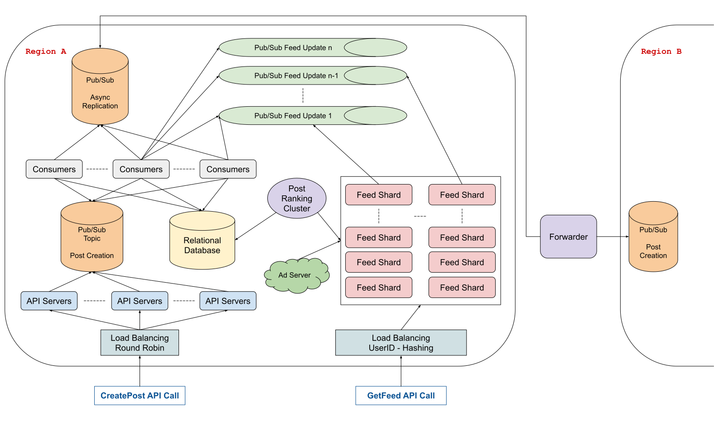

# 设计：Facebook News Feed

## 澄清要问的问题

- **问：Facebook News Feed 包含多个主要功能，例如加载用户的新消息推送、与之交互（即动态更新、喜欢帖子等）和实时更新（即添加新的状态更新实时发布到 Feed 的顶部）。我们正在设计 Facebook 动态消息的哪一部分？**

  答：我们正在设计 Feed 本身的核心功能，我们将定义如下：加载用户的消息推送并实时更新，以及动态更新。但是对于动态更新，我们不需要担心实际的 API 或用户可以发布的信息类型；我们只想设计一个 API 调用动态更新后需要处理的事情。最终，我们主要想设计数据管道的 Feed 生成/刷新部分（即如何/何时构建它，以及如何/何时用新帖子更新它）。

- **问：澄清一下，Facebook 上的帖子可能非常复杂，有图片、视频、特殊类型的状态更新等。你是说我们不关心系统的这方面吗？例如，我们不应该关注我们将如何存储此类信息吗？**

  答：没错。出于这个问题的目的，我们可以将帖子视为我们想要存储的不透明实体，但不必担心存储的细节、存储和提供视频等大文件带来的影响等。

- **问：我们是否设计了相关帖子管理系统（即决定哪些帖子将显示在用户的 News Feed 上的系统）？**

  答：不。我们不是在设计这个系统或任何排名算法。您可以假设您能够访问排名算法服务，您可以简单地将相关帖子列表提供给该算法，以便生成要显示的实际消息。

- **问：我们是否关心在用户的 News Feed 中显示广告？广告似乎与帖子的行为略有不同，因为它们可能依赖于不同的排名算法。**

  答：您可以将广告视为设计的附加部分；如果您找到一种方法将它们纳入其中，那就太好了（是的，您将有一些其他的广告服务算法来确定在任何时间点需要向用户展示哪些广告）。但不要专注于从广告开始。

- **问：我们是否为全球提供服务，我们的用户量有多大？**

  答：是的 —— 我们正在为全球用户提供服务，假设 News Feed 每天被 1 亿不同的用户加载大约 1 亿次，每天发布 100 万条新的状态更新。

- **问：一个用户平均有多少好友？了解这一点很重要，因为理论上用户的状态更新可能必须同时显示在用户的所有好友的 News Feed 中。**

  答：您可以期望每个用户在社交网络上平均拥有 500 个好友。您可以将每个用户的好友数视为钟形分布（两头小，中间大，分布在中间位置的变量值较多），有些用户的好友很少，有些用户的好友数量超过 500 个。

- **问：状态更新在发布后必须以多快的速度出现在 News Feed 中，如果这取决于用户位置（相对于用户提交帖子的位置）而有所不同，是否可以？**

  答：当用户发布内容时，您可能希望它很快出现在其他 News Feed 中。这个速度确实会因用户位置而异。例如，我们可能希望同一地区的本地好友在几秒钟内看到新帖子，但我们可能会同意世界另一端的用户在一分钟内看到相同的帖子。

- **问：我们的目标是什么样的可用性？**

  答：您的设计不能因单台机器故障而导致完全不可用，不过这不是高可用性要求。但是，用户一旦创建帖子后就不能丢失帖子内容。

## 1 收集系统要求

与任何系统设计面试问题一样，我们要做的第一件事就是收集系统需求；我们需要弄清楚我们正在构建什么系统。

我们正在设计 Facebook News Feed 的核心用户流程。这包括加载用户的新消息推送、滚动与他们相关的帖子列表、动态更新以及实时更新他们好友的 News Feed。我们正在专门设计生成和提供新消息数据的管道以及处理用户发布和更新实时新消息的系统。

我们正在与大约 10 亿用户打交道，平均每个用户有 500 个好友。

获取新消息数据需要一定的即时性，并且帖子在创建后应该在一分钟内更新用户的所有好友的 News Feed。根据用户位置，我们可能会在 Feed 更新方面存在一些差异。

此外，我们不能仅创建单个集群来为全球每个人提供服务，因为单个集群与世界某些地方的网络连接会存在较高的延迟，因此我们需要一种机制来确保新消息在一分钟内从帖子创建的区域发布到除本区域外的其它区域。

我们可以假设用于生成具有最相关帖子的 News Feed 的排名算法由我们可以访问的其他系统来处理。

## 2 制定计划

我们将从系统的外部调用开始向内规划，首先讨论两个 API 调用 CreatePost 和 GetNewsFeed，然后是新消息创建和存储策略、跨区域策略，最后以快速和可扩展的方式将所有设计联合到一起。

## 3 CreatePost API

出于本设计的目的，CreatePost API 调用将非常简单，如下所示：

```
CreatePost(
    user_id: string,
    post: data
)
```

当用户创建帖子时，API 调用会经过一些负载均衡，然后才进入到众多 API 服务器（它们是无状态的）之一。然后，这些 API 服务器在发布/订阅系统的主题上创建一条消息，通知其订阅者刚刚创建的新帖子。这些订阅者会执行一些操作，所以我们称他们为`S1`以供参考。每个订阅者`S1`从主题中读取并负责在关系数据库中创建 facebook 帖子。

## 4 后端存储

我们可以有一个主要的关系型数据库来存储我们系统的大部分数据，包括帖子和用户。该数据库将会数存储据量庞大的数据表。

## 5 GetNewsFeed API

GetNewsFeed API 调用很可能如下所示：

```
GetNewsFeed(
    user_id: string,
    pageSize: integer,
    nextPageToken: integer,
) => (
    posts: []{
        user_id: string,
        post_id: string,
        post: data,
    },
    nextPageToken: string,
)
```

pageSize 和 nextPageToken 字段用于对消息源进行分页；在处理大量数据时，分页是非常必要的，每个 News Feed 可能最多有 1000 个帖子。

## 6 消息创建和存储

由于我们的数据库表非常大，每周有数十亿用户和数千万条帖子，因此每次调用 GetNewsFeed 时从我们的主数据库中获取数据并不理想。从头开始构建 News Feed 时，我们不能期望低延迟，因为查询数据需要时间，并且分片保存帖子的主数据库方式不会特别有用，因为 News Feed 可能需要跨分片聚合帖子，这需要我们在生成数据时执行跨分片数据连接，我们需要避免这种情况。

相反，我们可以将数据与我们的主数据库分开存储在一系列分片中。我们可以有一个单独的机器集群，它可以充当关系数据库的代理，并负责聚合帖子，通过给定的排名算法对它们进行排名，生成 News Feed，并每隔一段时间将它们发送到我们的分片（每 5、10、60 分钟，取决于我们希望更新 News Feed 的频率）。

如果我们平均每个帖子为 10 KB，并且消息源包含与用户相关的前 1000 个帖子，那么每个用户 10 MB，或总计 10000 TB 的数据。我们假设每个用户每天加载 10 次，平均为 10 KB QPS 获取消息。

假设 10 亿个新消息（针对 10 亿用户）包含 1000 个帖子，每个帖子最大 10 KB，我们可以估计我们需要 10 PB（1 PB = 2<sup>50</sup> Byte）的存储空间来存储我们所有用户的数据。我们可以使用 1000 台 10 TB 的机器作为我们的数据源分片。

```
每个帖子约 10 KB
每个 News Feed 约 1000 个帖子
10 亿个 News Feed
10 KB * 1000 * 1000^3 = 10 PB = 1000 * 10 TB
```

为了大致均匀地分发数据源，我们可以参考用户 ID 进行分片。

当一个 GetNewsFeed 请求进来时，它会被负载均衡到正确的 News Feed 服务器上，该服务器通过在本地磁盘上读取来返回它。如果数据源在本地不存在，我们就需要去主要的数据源（主数据库，但经过了代理排名服务）收集相关帖子数据。这可能会导致延迟增加，但不会经常出现。

## 7 消息创建后的更新机制

我们现在需要一个通知机制，让数据存储分片知道刚刚创建了一个新的相关帖子，并且他们应该将其合并到受影响用户的消息数据中。

我们可以再次为此使用发布/订阅服务。每个数据分片都将订阅自己的主题 —— 我们将这些主题称为 Feed 通知主题（FNT） —— 原始订阅者`S1`将成为 FNT 的发布者。当`S1`收到有关创建帖子的新消息时，它会在主数据库中搜索与该帖子相关的所有用户（搜索创建该帖子的用户的所有好友），过滤掉来自其他将被异步处理的区域的用户，使用我们的 GetNewsFeed 负载均衡服务所依赖的哈希函数将剩余用户映射到 FNT。

对于影响到太多用户的帖子，我们可以限制收到消息的 FNT 主题的数量，以减少单个帖子产生的峰值数据。对于那些好友较多的用户，我们可以依靠异步处理消息创建，并在未及时通知到的用户手动刷新 Feed 时显示该消息提醒。

## 8 跨区域策略

当 CreatePost 被调用并到达我们的发布订阅服务中的订阅者时，他们将向另一个发布订阅主题发送消息，区域之间的某些转发服务将订阅该主题。转发服务的工作，顾名思义，就是将消息转发到其他区域，以便在其他区域复制所有 CreatePost 的执行逻辑。一旦转发服务收到消息，它基本上会模仿在另一个区域调用相同的 CreatePost 所产生的操作，这将在其他区域重新执行新消息的更新逻辑。我们可以将一些额外的逻辑传递给转发服务，以防止其他不相关的区域再次执行了 CreatePost 的逻辑，导致无限的循环；换句话说，我们可以只让发帖的区域来负责通知其他区域执行更新逻辑。

来自 Uber 和 Confluent 等大公司的一些开源技术就是为这种操作而设计的。

## 9 系统架构图



Last Modified 2022-03-27
