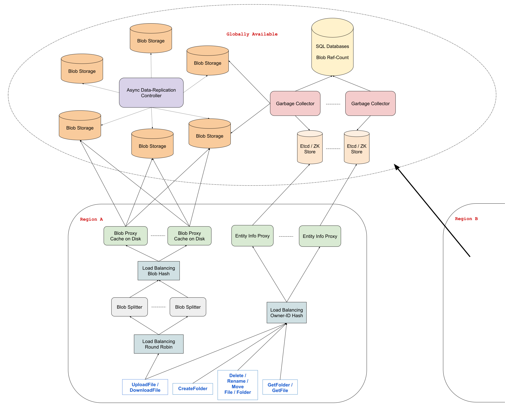

# 设计：谷歌云端硬盘

## 澄清要问的问题

- **问：我们只是在设计 Google Drive 的存储方面，还是我们也在设计一些相关的产品，如 Google Docs、Sheets、Slides、Drawings 等？**

  答：我们只是在设计核心的 Google Drive 产品，它确实是存储产品。换句话说，用户可以创建文件夹并上传文件，从而有效地将它们存储在云端。此外，为简单起见，我们可以将文件夹和文件称为“实体”。

- **问：Google Drive 上有很多功能，例如共享公司存储与个人存储、实体权限 (ACL)、已加星标的文件、最近访问的文件等。我们是在设计所有这些功能还是仅设计他们中的一部分？**

  答：让我们把范围缩小，想象一下我们正在设计一个个人 Google Drive（这样您就可以忘记共享的公司存储）。在个人 Google Drive 中，用户可以存储实体，这就是您应该注意的全部。忽略任何不是 Google Drive 存储方面核心的功能；忽略加星标的文件、最近访问的文件等。您甚至可以忽略此设计的共享实体。

- **问：由于我们主要关注存储实体，我们是否支持所有基本的 CRUD 操作，例如创建、删除、重命名和移动实体？**

  答：是的，但要澄清一下，创建文件实际上是上传文件，必须创建文件夹（不能上传），我们也希望支持下载文件。

- **问：我们只是在设计 Google Drive Web 应用程序，还是也在为 Google Drive 设计桌面客户端？**

  答：我们只是在设计 Google Drive 网络应用程序的功能。

- **问：既然我们不处理共享实体，我们应该同时处理单个文件夹中的多个用户，还是我们可以假设这永远不会发生？**

  答：虽然我们没有设计共享功能，但我们仍然要处理如果多个客户端同时位于一个文件夹中会发生什么（例如，来自同一浏览器的两个选项卡）。在这种情况下，我们希望在该文件夹中所做的更改能够在 10 秒内反映给所有客户端。但是为了这个问题的目的，我们不要担心冲突或类似的事情（即假设两个客户端不会同时对同一个文件或文件夹进行更改）。

- **问：我们为多少用户构建这个系统？**

  答：这个系统应该为 10 亿左右的用户提供服务，平均每个用户可以使用 15GB 的磁盘空间。

- **问：这项 Google Drive 服务为其用户提供了什么样的可靠性或保证？**

  答：首先，数据丢失是绝对不能容忍的；我们需要确保一旦上传文件或创建文件夹，它不会消失，直到用户删除它。至于可用性，我们需要这个系统是高可用的。

## 1 收集系统要求

与任何系统设计面试问题一样，我们要做的第一件事就是收集系统需求；我们需要弄清楚我们正在构建什么系统。

我们正在设计 Google Drive 网络应用程序的核心用户流程。这包括存储两个主要实体：文件夹和文件。更具体地说，系统应该允许用户创建文件夹、上传和下载文件，以及在存储实体后重命名和移动实体。我们不必担心 ACL、共享实体或任何其他 Google Drive 辅助功能。

我们将大规模构建这个系统，假设有 10 亿用户，每个用户平均在 Google Drive 中存储 15GB 的数据。这总共增加了大约 15,000 PB 的数据，这还不包括我们可能为每个实体存储的任何元数据，例如其名称或类型。

我们需要这项服务是高度可用的并且非常冗余。即使在世界整个地区发生灾难性故障，成功存储在 Google 云端硬盘中的数据也不会丢失。

## 2 制定计划

重要的是要将必要的信息组织起来，并就我们将如何处理我们的设计制定一个清晰的计划。我们的系统有哪些主要的、可区分的组件？

首先，我们需要支持以下操作：

对于文件：

- 上传文件
- 下载文件
- 删除文件
- 重新命名文件
- 移动文件

对于文件夹：

- 创建文件夹
- 获取文件夹
- 删除文件夹
- 重命名文件夹
- 移动文件夹

其次，我们必须为两种类型的数据提供合适的存储解决方案：

- 文件内容：上传到 Google Drive 的文件的内容。这些是不透明的字节，没有特定的结构或格式。
- 实体信息：每个实体的元数据。这可能包括 entityID、ownerID、lastModified、entityName、entityType 等字段。此列表并非详尽无遗，我们很可能会在稍后添加。

让我们首先回顾一下我们想要使用的存储解决方案，然后我们将了解执行上述每个操作时会发生什么。

## 3 存储实体信息

要存储实体信息，我们可以使用键值存储。由于我们需要高可用性和数据复制，我们需要使用诸如 Etcd、Zookeeper 或 Google Cloud Spanner（作为 KV 存储）之类的东西来为我们提供这些保证和一致性（例如，与 DynamoDB 不同，后者只会给我们最终的一致性）。

由于我们将处理许多 GB 大小的实体信息（考虑到我们为 10 亿用户提供服务），我们需要在这些 K-V 存储的多个集群中分割这些数据。共享 entityID 意味着我们将失去执行批处理操作的能力，这些键值存储的信息是我们移动实体时所需的（例如，将文件从一个文件夹移动到另一个文件夹将涉及编辑 3 个实体的元数据；如果它们位于 3 个不同的分片中，那就不会很容易实现了）。相反，我们可以根据实体的 ownerID 进行分割，这意味着我们可以用一个事务原子地编辑多个实体的元数据，只要这些实体属于同一个用户。

鉴于该网站服务需要较多的流量，我们可以为实体信息设置一层代理，利用 ownerID 的哈希计算进行负载均衡。代理可以有一些缓存，并在我们最终决定支持它们时执行 ACL 检查。代理将放在区域层级，而原始键值存储则为全球范围内可访问。

## 4 存储文件数据

在处理可能非常庞大的数据上传和数据存储时，将数据拆分为可以拼凑在一起形成原始数据的 blob 通常是有利的。上传文件时，请求将在我们称为“blob 拆分器”的多个服务器之间进行负载均衡，这些 blob 拆分器将负责将文件拆分为 blob 并将这些 blob 存储在一些全局 blob 存储解决方案中，如 GCS 或 S3（因为我们正在设计 Google Drive，所以选择 S3 而不是 GCS 可能不是一个好主意 :P）。

要记住的一件事是，我们需要为上传的数据提供大量冗余，以防止数据丢失。所以我们可能想要采用这样的策略：尝试推送到 3 个不同的 GCS 存储桶，并且只有在至少通过 2 个存储桶时才认为写入成功。这样，我们总是有冗余而不必牺牲可用性。在后台，我们可以有一个额外的服务来负责以异步方式进一步将数据复制到其他存储桶。对于我们主要的 3 个存储桶，我们将希望在 3 个不同的可用区域中选择存储桶，以避免在发生自然灾害或大规模停电时，我们的所有冗余存储都被潜在的灾难性故障摧毁。

为了避免在我们的 blob 存储中存储多个相同的 blob，我们将会对 blob 的内容进行哈希运算后命名这些 blob。这种技术称为 Content-Addressable Storage，通过使用它，我们基本上可以使所有 blob 在存储中不可变。当一个文件发生变化时，我们只需上传整个新生成的 blob 并重新使用哈希运算新的名称保存。

这种不可变性非常强大，部分原因是它意味着我们可以很容易地在 blob 拆分器和存储桶之间引入一个缓存层，而无需担心在进行编辑时保持缓存与主要数据源同步 —— 只需处理完全不同的 blob 就可以了。

## 5 实体信息结构

由于文件夹和文件都有共同的元数据位，我们可以让它们共享相同的结构。不同之处在于文件夹将 is_folder 标志设置为 true 和 children_ids 列表，该列表将指向相关文件夹中文件夹和文件的实体信息。文件的 is_folder 标志设置为 false 和 blobs 字段，其中包含构成相关文件中数据的所有 blob 的 ID。两个实体也可以有一个 parent_id 字段，该字段将指向实体父文件夹的实体信息。这将有助于我们在移动文件和文件夹时快速找到父级。

- 文件信息

  ```
  {
    blobs: ['blob_content_hash_0', 'blob_content_hash_1'],
    id: 'some_unique_entity_id'
    is_folder: false,
    name: 'some_file_name',
    owner_id: 'id_of_owner',
    parent_id: 'id_of_parent',
  }
  ```

- 文件夹信息

  ```
  {
    children_ids: ['id_of_child_0', 'id_of_child_1'],
    id: 'some_unique_entity_id'
    is_folder: true,
    name: 'some_folder_name',
    owner_id: 'id_of_owner',
    parent_id: 'id_of_parent',
  }
  ```

## 6 垃圾收集

对现有文件的任何更改都将创建一个全新的 blob 并取消对旧文件的引用。此外，任何已删除的文件也将取消引用文件的 blob。这意味着我们最终会得到大量未使用且无缘无故占用存储空间的孤立 blob。我们需要一种方法来清理这些碎片以释放一些空间。

我们可以有一个垃圾收集服务来监视实体信息 KV 存储并记录每个 blob 被文件引用的次数；这些计数记录可以存储在 SQL 表中。

每当上传和删除文件时，引用计数都会更新。当特定 blob 的引用计数达到 0 时，垃圾收集器可以在相关 blob 存储中将有问题的 blob 标记为孤立，并且如果 blob 尚未被访问，则该 blob 将在一段时间后被安全删除。

## 7 端到端 API 流

现在我们已经设计了整个系统，我们可以了解当用户执行我们上面列出的任何操作时会发生什么。

CreateFolder 很简单；由于文件夹没有 blob-storage 组件，因此创建文件夹只涉及在我们的键值存储中存储一些元数据。

UploadFile 分两步工作。第一个是将构成文件的 blob 存储在 blob 存储中。一旦 blob 被持久化，我们就可以创建文件信息对象，将 blob 内容哈希存储在其 blobs 字段中，并将此元数据写入我们的键值存储。

DownloadFile 从给定文件 ID 的键值存储中获取文件的元数据。元数据包含构成文件内容的所有 blob 的哈希值，我们可以使用它从 blob 存储中获取所有 blob。然后我们可以将它们组装成文件并将其保存到本地磁盘上。

所有的 Get、Rename、Move 和 Delete 操作都通过事务的原子性操作来更改我们的键值存储中的一个或多个实体的元数据。

## 8 系统架构图



Last Modified 2022-04-04
