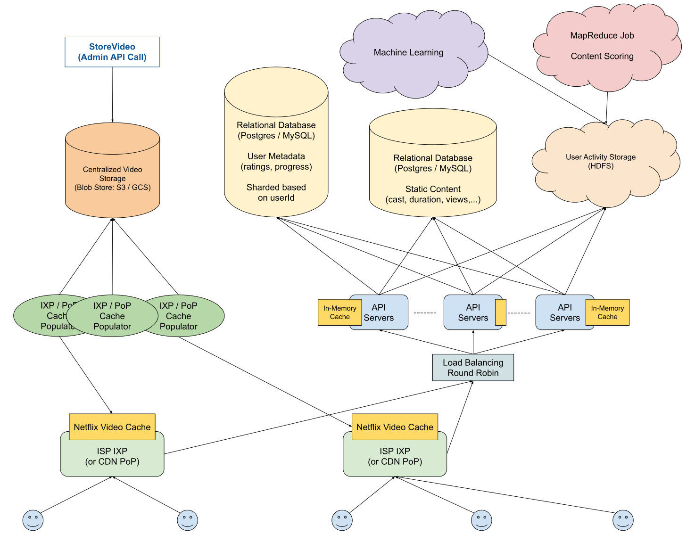

# 设计：奈飞

## 澄清要问的问题

- **问：从高层次的角度来看，Netflix 是一项相当简单的服务：用户访问平台，然后观看影视节目。我们是完全设计这个高级系统，还是希望我专注于特定的子系统，比如 Netflix 主页？**

  答：我们只是在设计核心的 Netflix 产品 —— 所以你描述的总体系统/产品。

- **问：我们应该担心身份验证和支付等辅助服务吗？**

  答：你可以忽略那些辅助服务；关注主要用户流。话虽如此，需要注意的一件事是，根据产品的性质，我们将可以访问大量需要处理的用户活动数据，以启用 Netflix 的推荐系统。您需要想出一种方法来汇总和处理网站上的用户活动数据。

- **问：对于这个推荐系统，我是否应该考虑为其提供实际能力的算法？**

  答：不，您无需担心为推荐引擎实施任何算法或公式。您只需要考虑如何收集和处理用户活动数据。

- **问：听起来这个系统有两个重点：视频服务和推荐引擎。关于视频服务，可以假设我们正在全球范围内提供高可用性服务和低延迟访问；它是否正确？**

  答：是的，但澄清一下，视频流服务实际上是系统中唯一需要我们关心低延迟访问的部分。

- **问：那么推荐引擎是一个接受您提到的用户活动数据并在后台异步运行的系统吗？**

  答：是的

- **问：我们希望为多少用户构建这个？**

  答：Netflix 有大约 100M 到 200M 的用户，所以我们选择 200M（2 亿）。

- **问：我们是否应该担心为各种客户端设计这个系统，比如桌面客户端、移动客户端等？**

  答：尽管我们确实在设计 Netflix 以供各种客户端使用，但让我们只关注分布式系统组件 —— 因此无需深入了解客户端的细节或针对某些客户端进行优化。

## 1 收集系统要求

与任何系统设计面试问题一样，我们要做的第一件事就是收集系统需求；我们需要弄清楚我们正在构建什么系统。

我们正在设计核心 Netflix 服务，该服务允许用户从 Netflix 网站流式传输电影和节目。

具体来说，我们将重点关注：

- 无需过多缓冲即可向全球数亿用户提供大量高清视频内容。
- 处理大量用户活动数据以支持 Netflix 的推荐引擎。

## 2 制定计划

我们将通过将其分为四个主要部分来解决这个系统：

- 存储（视频内容、静态内容和用户元数据）
- 一般客户端-服务器交互（如查询的生命周期）
- 视频内容交付
- 用户活动数据处理

## 3 视频内容存储

由于 Netflix 面向数百万客户的服务以视频内容为中心，因此我们可能需要大量存储空间和复杂的存储解决方案。让我们从估计需要多少空间开始。

我们被告知 Netflix 有大约 2 亿用户；我们可以对其他 Netflix 指标做出一些假设（或者，我们可以在这里向面试官寻求指导）：

- Netflix 在任何给定时间提供大约 10,000 部电影和节目
- 由于电影最长可达 2 小时以上，而节目每集往往在 20 到 40 分钟之间，我们可以假设平均视频长度为 1 小时
- 每部电影/节目将有一个标准清晰度版本和一个高清版本。SD 将占用大约 10GB/h 的空间，而 HD 将占用大约 20GB/h 的空间

```
~10K 视频 (普通清晰度和高清)
~平均 1 小时的视频时长
~10 GB/h for SD + ~20 GB/h for HD = 30 GB/h 每个视频
~30 GB/h * 10K 视频 = 300,000 GB = 300 TB
```

这个数字突出了估计的重要性。天真地，人们可能会认为 Netflix 存储了许多 PB 的视频，因为它的核心产品围绕着视频内容；但是一个简单的后台估计告诉我们，它实际上存储了非常少量的视频。

这是因为 Netflix 与 YouTube、Google Drive 和 Facebook 等其他服务不同，它拥有有限数量的视频内容：由 Netflix 自身提供的电影和节目；这与其他平台允许用户上传无限量的视频不同。

由于我们只处理几百 TB 的数据，我们可以使用 S3 或 GCS 等简单的 blob 存储解决方案来可靠地处理 Netflix 视频内容的存储和复制；我们不需要更复杂的数据存储解决方案。

## 4 静态内容存储

除了视频内容，我们还想为 Netflix 的电影和节目存储各种静态内容，包括视频标题、描述和演员列表。

此内容的大小将受视频内容大小的限制，因为它与电影和节目的数量相关，就像视频内容一样，而且它自然会比视频数据占用更少的空间。

我们可以轻松地将所有这些静态内容存储在关系数据库甚至文档存储中，并且我们可以将大部分内容缓存在我们的 API 服务器中。

## 5 用户元数据存储

我们可以期望为 Netflix 平台上的每个视频存储一些用户元数据。例如，我们可能想要存储用户观看视频进度的时间戳、用户对视频的评分等。

就像上面提到的静态内容一样，这个用户元数据将与 Netflix 上的视频数量相关联。但是，与静态内容不同，此用户元数据将随着 Netflix 用户群的增长而增长，因为每个用户都将拥有用户元数据。

我们可以快速估计这个用户元数据需要多少空间：

```
~200M 用户
~每个用户每个生命周期观看 1K 视频 (~约占总内容的 10%)
~100 字节/视频/用户
~100 字节 * 1K 视频 * 200M 用户 = 100 KB * 200M = 1 GB * 20K = 20 TB
```

也许令人惊讶的是，我们将在与我们所存储的视频内容量相同的范围内存储大量用户元数据。再次强调，这是因为 Netflix 视频内容的有限性质与其用户群的无限性质形成鲜明对比。

我们可能需要查询此元数据，因此将其存储在像 Postgres 这样的经典关系数据库中是有意义的。

由于 Netflix 用户实际上是相互隔离的（例如，他们不像在社交媒体平台上那样相互连接），我们可以预期我们所有对延迟敏感的数据库操作都只与单个用户相关。换句话说，像 GetUserInfo 和 GetUserWatchedVideos 这样需要低延迟的潜在操作是特定于用户的；另一方面，涉及多个用户元数据的复杂数据库操作可能是不关心延迟的后台数据工程工作的一部分。

鉴于此，我们可以将我们的用户元数据数据库拆分为几个分片，每个分片管理 1 到 10 TB 的索引数据。这将为固定用户保持非常快速的读取和写入。

## 6 一般客户端-服务器交互

处理向用户提供用户元数据和静态内容的系统部分不应该太复杂。

我们可以使用一些简单的循环负载均衡来在我们的 API 服务器上分发最终用户网络请求，然后可以根据 userId 对数据库请求进行负载均衡（因为我们的数据库将根据 userId 进行分片）。

如上所述，我们可以将静态内容缓存在我们的 API 服务器中，并在新电影和节目发布时定期更新它，我们甚至可以使用直接读写缓存的机制将用户元数据缓存在 API 服务器中。

## 7 视频内容交付

我们需要弄清楚我们将如何在全球范围内以极小的延迟交付 Netflix 的视频内容。首先，我们将估计在任何时间点我们可以预期的最大带宽消耗量。我们假设，在流量高峰期，比如当一部热门电影上映时，相当多的 Netflix 用户可能会同时访问视频内容。

```
~200M 总计用户
~5% 的总用户在高峰时段同时观看流媒体
~20 GB/h 高清视频 ~= 5 MB/s 高清视频
~5% * 200M * 5 MB/s = 10M * 5 MB/s = 50 TB/s
```

这种带宽消耗水平意味着我们不能简单地从单个数据中心甚至数十个数据中心提供视频内容。我们需要世界各地的数千个地点为我们分发这些内容。值得庆幸的是，CDN 可以解决这个问题，因为它们在全球拥有数千个节点。因此，我们可以使用像 Cloudflare 这样的 CDN，并从 CDN 的 PoP 中提供我们的视频内容。

由于 PoP 无法将 Netflix 的全部视频内容保存在缓存中，我们可以有一个外部服务，定期用最重要的内容（最有可能被观看的电影和节目）重新填充 CDN PoP。

## 8 用户活动数据处理

我们需要弄清楚我们将如何处理大量用户活动数据以输入 Netflix 的推荐引擎。我们可以想象，这些用户活动数据将以各种用户操作生成的日志的形式收集；我们可以预期每天都会生成数 TB 的这些日志。

MapReduce 可以在这里为我们提供帮助。我们可以将日志存储在 HDFS 等分布式文件系统中，并运行 MapReduce 作业以并行处理大量数据。然后可以将这些作业的结果输入一些机器学习管道或简单地存储在数据库中。

- **Map 输入**

  我们的 Map 输入可以是我们的原始日志，可能如下所示：

  ```
  {"userId": "userId1", "videoId": "videoId1", "event": "CLICK"}
  {"userId": "userId2", "videoId": "videoId2", "event": "PAUSE"}
  {"userId": "userId3", "videoId": "videoId3", "event": "MOUSE_MOVE"}
  ```

- **Map 输出 / Reduce 输入**

  我们的 Map 函数将基于 userId 聚合日志，并返回索引在每个 userId 上的中间键值对，指向具有 videoId 和相关事件的元组列表。

  这些中间的 K/V 对将被适当地分类并输入到我们的 Reduce 函数中。

  ```
  {"userId1": [("CLICK", "videoId1"), ("CLICK", "videoId1"), ..., ("PAUSE", "videoId2")]}
  {"userId2": [("PLAY", "videoId1"), ("MOUSE_MOVE", "videoId2"), ..., ("MINIMIZE", "videoId3")]}
  ```

- **Reduce 输出**

  我们的 Reduce 函数可以返回许多不同的输出。他们可以为每个 userId/videoId 组合返回 K/V 对，指向该 user/video 对的计算分数；他们可以返回在每个 userId 处索引的 K/V 对，指向 (videoId, score) 元组列表；或者他们可以返回 K/V 对，索引每个 userId 并指向 videoIds 的堆栈，然后基于计算的分数进行排序。

  ```
  ("userId1|videoId1", score)
  ("userId1|videoId2", score)

  或者

  {"userId1": [("videoId1", score), ("videoId2", score), ..., ("videoId3", score)]}
  {"userId2": [("videoId1", score), ("videoId2", score), ..., ("videoId3", score)]}

  或者

  ("userId1", ["videoId1", "videoId2", ..., "videoId3"])
  ("userId2", ["videoId1", "videoId2", ..., "videoId3"])
  ```

## 9 系统架构图



Last Modified 2022-04-04
