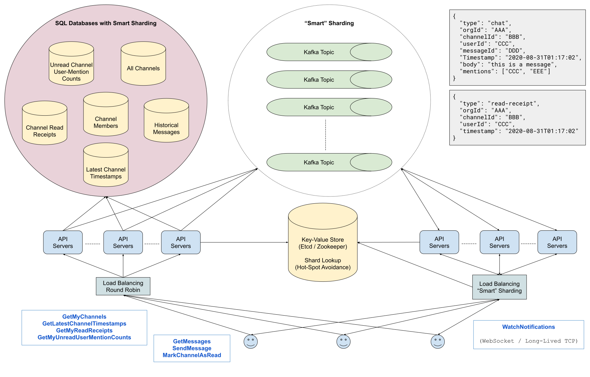

# 设计：Slack

## 澄清要问的问题

- **问：你可以在 Slack 上做很多事情。首先，您使用 Slack 与组织内的一对一频道、私人频道或公共频道中的人员进行交流。但是你也可以在 Slack 上做很多其他的事情，比如创建和删除频道、更改频道设置、更改 Slack 设置、邀请人们加入频道等等。我们在这里设计的到底是什么？**

  答：我们正在设计核心消息传递功能，其中涉及在组织中的一对一频道和群组频道中进行通信。您不必担心频道设置和所有这些额外功能。

- **问：你需要我关注私人频道的概念吗？**

  答：就访问控制而言，我们只关注频道中的用户；我们可以忘记私人频道的概念。

- **问：关于通信，据我对 Slack 的了解，当您加载 Web 应用程序或桌面/移动应用程序时，您显然可以访问您所在频道（包括一对一频道）的所有消息，并且还会通知您有未读消息的频道以及您在每个频道中的未读消息次数。如果我没记错的话，带有未读消息的频道是粗体的，并且未读消息的数量在频道名称旁边简单可见。我们是否应该设计我们的系统来适应这种情况？**

  答：是的，我们应该注意这一点。在那一点上，我们要处理的一件事是跨设备同步。换句话说，如果您同时打开了 Slack 桌面应用程序和 Slack 移动应用程序，并且两个应用程序都显示一个频道未读，并且您在其中一个应用程序上阅读了该频道，那么另一个应用程序应该立即更新并且应该将频道标记为已读。你必须处理这个。

- **问：顺便说一句，说到不同的应用程序，我们是在设计各种设备/软件应用程序，还是只是前端/客户端与之通信的后端系统？**

  答：对于这个问题，您只会真正关注后端系统。

- **问：此外，实际的 Slack 消息中有很多不同的特性。例如，添加自定义表情符号、固定消息、保存消息、编写代码片段或文本块等。你想让我处理所有这些吗？**

  答：不，您现在可以将消息视为纯文本。当然，您将设计的内容可能会扩展到不同类型的消息，并且最终将能够处理诸如固定或保存消息之类的事情，但是对于当前设计，不必担心这一点。

- **问：我们希望为多少用户构建这个系统？最大的 Slack 用户组织有多大？它有多少用户？**

  答：Slack 有大约 10 到 2000 万用户，所以我们以 2000 万为例。至于组织，假设最大的单个 Slack 客户在同一个组织中有 50,000 人。如果一个组织的所有员工都在同一个频道中（例如典型的#general 频道），我们还可以近似认为最大的频道将具有相同的大小。

- **问：由于这是一个聊天应用程序，我假设低延迟是我们的首要任务之一，而且由于这项服务影响数百万用户，我假设我们应该在设计时考虑到高可用性。这些是正确的假设吗？**

  答：对这两件事都是可以的，但是为了更加专注，不要担心优化可用性。让我们主要关注延迟和核心功能。

- **问：我们是为全球观众打造这个，还是应该专注于一个地区？**

  答：让我们为这个问题处理单个区域，但就像可用性一样，不要过分关注设计的这方面。

## 1 收集系统要求

与任何系统设计面试问题一样，我们要做的第一件事就是收集系统需求；我们需要弄清楚我们正在构建什么系统。

我们正在设计 Slack 背后的核心通信系统，它允许用户在 Slack 频道中发送即时消息。

具体来说，我们希望支持：

- 当用户点击频道时，加载 Slack 频道中的最新消息。
- 当该用户加载 Slack 时，立即查看该用户的哪些频道有未读消息。
- 当该用户加载 Slack 时，立即查看哪些频道有特定用户的未读消息，更具体地说，是每个相关频道中这些未读消息的数量。
- 即时、实时地发送和接收 Slack 消息。
- 跨设备同步：如果用户同时打开了 Slack 桌面应用程序和 Slack 移动应用程序，并且两者都有未读频道，并且如果他们在一台设备上阅读了该频道，则应立即更新第二台设备并且不再显示频道未读。

该系统应该具有低延迟和高可用性，以满足大约 2000 万用户的单个区域。最大的 Slack 组织将拥有多达 50,000 名用户，其中的频道规模相同。

话虽如此，就本设计而言，我们应该主要关注延迟和核心功能；在合理的范围内可以忽略可用性和区域性。

## 2 制定计划

我们将通过将其分为两个主要部分来解决这个系统：

- 处理 Slack 应用程序加载时发生的情况。
- 处理实时消息传递以及跨设备同步。

我们可以将第一部分进一步划分如下：

- 查看用户所属的所有频道。
- 在特定频道中查看消息。
- 查看哪些频道有未读消息。
- 查看哪些频道有未读消息以及有多少条未读消息。

## 3 持久存储解决方案和应用程序加载

虽然我们设计的很大一部分涉及实时通信，但另一大部分涉及在 Slack 应用程序加载时的任何给定时间检索数据（频道、消息等）。为了支持这一点，我们需要一个持久存储解决方案。

具体来说，我们将选择 SQL 数据库，因为我们可以期望这些数据是结构化的并且经常被查询。

我们可以从一个简单的表开始，该表将存储每个 Slack 频道。

- 频道（Channels）

  | id (channelId): uuid | orgId: uuid | name: string | description: string |
  | -------------------- | ----------- | ------------ | ------------------- |
  | ...                  | ...         | ...          | ...                 |

然后，我们可以有另一个表示频道成员的简单表：该表中的每一行将对应于特定频道中的特定用户。我们将使用此表以及上面的表在应用加载时获取用户的相关信息。

- 频道成员（Channel Members）

  | id: uuid | orgId: uuid | channelId: uuid | userId: uuid |
  | -------- | ----------- | --------------- | ------------ |
  | ...      | ...         | ...             | ...          |

我们自然需要一个表来存储在 Slack 上发送的所有历史消息。这将是我们容量最大的表，每次用户在特定频道中获取消息时都会对其进行查询。将与此表交互的 API 接口将返回分页响应，因为我们通常只需要每个频道 50 或 100 条最新消息。

另外，这个表只会在用户点击频道时被查询；我们不想在应用加载时为用户的所有频道获取消息，因为用户可能永远不会查看他们的大部分频道。

- 历史消息（Historical Messages）

  | id: uuid | orgId: uuid | channelId: uuid | senderId: uuid | sentAt: timestamp | body: string | mentions: List\<uuid\> |
  | -------- | ----------- | --------------- | -------------- | ----------------- | ------------ | ---------------------- |
  | ...      | ...         | ...             | ...            | ...               | ...          | ...                    |

为了在应用加载时不获取每个频道的最新消息，同时支持显示哪些频道有未读消息的功能，我们需要存储两个额外的表：一个用于每个频道中的最新活动（此表将每当用户在频道中发送消息时更新），并且在特定用户最后一次阅读频道时更新（每当用户打开频道时都会更新此表）。

- 最新频道时间戳（Latest Channel Timestamps）

  | id: uuid | orgId: uuid | channelId: uuid | lastActive: timestamp |
  | -------- | ----------- | --------------- | --------------------- |
  | ...      | ...         | ...             | ...                   |

- 频道已读回执（Channel Read Receipts）

  | id: uuid | orgId: uuid | channelId: uuid | userId: uuid | lastSeen: timestamp |
  | -------- | ----------- | --------------- | ------------ | ------------------- |
  | ...      | ...         | ...             | ...          | ...                 |

对于我们想要在频道名称旁边显示的未读用户消息提醒的数量，我们将有另一个类似于已读回执的表，区别在这个表有未读消息提醒计数而不是时间戳记录。每当用户当前未在查看的频道有新消息时，此计数将更新（增加），并且每当用户查看存在未读消息的频道时，它也会更新（重置为 0）。

- 未读频道用户消息提醒计数（Unread Channel-User-Mention Counts）

  | id: uuid | orgId: uuid | channelId: uuid | userId: uuid | count: int |
  | -------- | ----------- | --------------- | ------------ | ---------- |
  | ...      | ...         | ...             | ...          | ...        |

## 4 负载均衡

对于客户端将在应用程序加载时发出的所有 API 调用，包括写入我们的数据库（发送消息或将频道标记为已读时），我们将需要负载均衡。

我们可以有一个简单的循环负载均衡器，将请求转发到一组服务器集群，然后这些集群将处理将请求传递到我们的数据库。

## 5 “智能”分片

由于我们的表容量会非常大，尤其是消息表，我们需要进行一些分片。

自然的方法是根据组织规模进行分片：我们可以在各自的分片中优先保存较大的组织（具有最多的频道），我们可以将较小的组织组合在其他分片中。

这里需要注意的重要一点是，随着时间的推移，组织规模和组织内的 Slack 活动将会发生变化。一些组织的规模可能在一夜之间翻倍，其他组织可能会经历看似随机的活动激增等。这意味着，尽管我们的分片策略相对完善，但我们仍然可能遇到突发峰值的情况，这可能会导致系统的访问延迟突然增加。

为了解决这个问题，我们可以添加一个“智能”分片解决方案：我们系统的一个子系统，它将异步测量组织活动并相应地“重新平衡”分片。该服务可以是强一致的键值对存储，如 Etcd 或 ZooKeeper，将 orgIds 映射到分片。我们的 API 服务器将与此服务通信，以了解将请求路由到哪个分片。

## 6 用于实时响应的发布/订阅系统

我们希望支持两种类型的实时行为：

- 实时发送和接收消息。
- 跨设备同步（如果您在两台设备上打开 Slack 并在其中一台设备上查看频道，则立即将频道标记为已读）。

对于这两个功能，我们可以依赖 Pub/Sub 消息传递系统，它本身将依赖于我们之前描述的“智能”分片策略。

每个 Slack 组织或组织分组都将被分配到一个 Kafka 主题，并且每当用户在频道中发送消息或将频道标记为已读时，我们前面提到的处理与我们的数据库对话的 API 服务器也将发送一个 Pub/Sub 消息到相应的 Kafka 主题。

Pub/Sub 消息将如下所示：

```
{
  "type": "chat",
  "orgId": "AAA",
  "channelId": "BBB",
  "userId": "CCC",
  "messageId": "DDD",
  "timestamp": "2020-08-31T01:17:02",
  "body": "this is a message",
  "mentions": ["CCC", "EEE"]
},
{
  "type": "read-receipt",
  "orgId": "AAA",
  "channelId": "BBB",
  "userId": "CCC",
  "timestamp": "2020-08-31T01:17:02"
}
```

然后，我们将有一组不同的 API 服务器订阅各种 Kakfa 主题（可能每个主题一个 API 服务器集群），我们的客户端（Slack 用户）将与这些 API 服务器集群建立长期 TCP 连接以接收 Pub/Sub 实时消息。

我们希望在客户端和这些 API 服务器之间有一个负载均衡器，它还将使用“智能”分片策略将客户端与适当的 API 服务器相匹配，这些 API 服务器将监听适当的 Kafka 主题。

当客户端收到 Pub/Sub 消息时，他们会相应地处理它们（例如，将频道标记为未读），如果客户端刷新他们的浏览器或他们的移动应用程序，他们将通过我们之前描述的整个“应用程序加载”系统。

由于每个 Pub/Sub 消息都带有时间戳，并且由于读取通道和发送 Slack 消息涉及写入我们的持久存储，因此 Pub/Sub 消息将有效地是幂等操作。

## 7 架构图



Last Modified 2022-04-09
